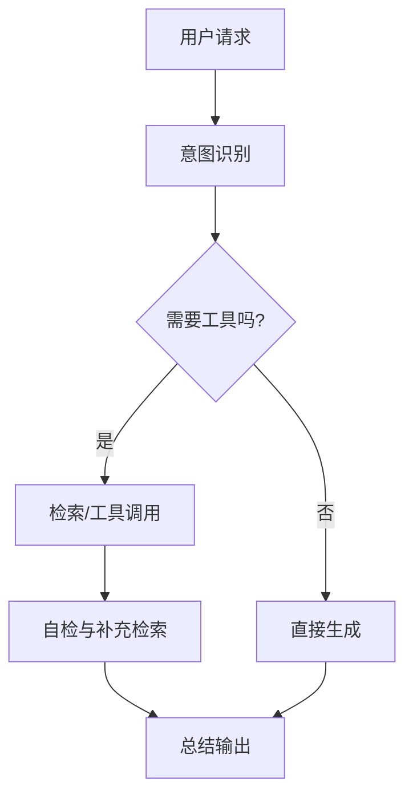

# Workflow 编排

## 设计目标
- 将 Agent 能力拆成可观测、可重试的节点。
- 每个节点只做一件事：检索、调用工具、总结。
- 支持 A/B 与回退，便于快速上线与回滚。

## 典型编排（Mermaid）

## 数据驱动的迭代
- 将每个节点的输入/输出打日志，集中在可观测平台。
- 失败样本进入重训/微调数据集；成功样本进入“黄金案例”。
- 关键指标：
  - 命中率/召回率（检索阶段）
  - 任务完成率（端到端）
  - 延迟与成本（分节点）

## 版本与回滚
- 为提示、模型、工具版本打标签，写入上下文。
- 在 DAG 层面支持灰度开关：按用户分流或按场景分流。
- 保留安全兜底：当所有分支失败时，返回默认响应并记录告警。
